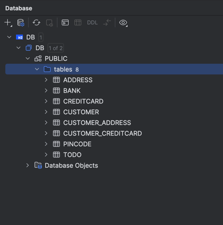

# LAB03

## Technical Problems and Resolutions

During the installation and use of Java Persistence Architecture (JPA), I encountered several technical problems:

1. **Transient Object Exception**:
    - **Problem**: The error "TransientObjectException: persistent instance references an unsaved transient instance of 'no.hvl.dat250.jpa.tutorial.creditcards.CreditCard' (save the transient instance before flushing)" was encountered.
    - **Resolution**: Persisted the `CreditCard` instances before persisting the `Customer` instance to ensure all entities were persisted in the correct order.

2. **Assertion Error in Tests**:
    - **Problem**: The test failed with an assertion error due to collection type differences.
    - **Resolution**: Updated the `Address` and `Customer` classes to ensure `Set` and `HashSet` is being used.

3. **Unable to find persistor**:
    - **Problem**: When I ran the tests after thinking I had everything done, I got an error saying "Unable to find persistor for no.hvl.dat250.jpa.tutorial.creditcards.CreditCard".
    - **Resolution**: I had to add class xml tags to the persistence.xml file to make sure the classes were being recognized. I do not know still why the automatic discovery did not work.

## Link to Code

You can find the code [here](https://github.com/VojtechLunak/dat250-jpa-tutorial).

## Database Inspection

To inspect the database tables, I used the Database functionality of IntelliJ Idea. I just entered the path of the file where the database is stored and then I was able to see the tables and their contents.

This is the SQL to create customer table (got DDL from IntelliJ Idea Database):

```sql
create table PUBLIC.CUSTOMER
(
    ID   BIGINT auto_increment
        primary key,
    NAME CHARACTER VARYING(255)
);
```

Here is the screenshot of the database tables (TODO table is there because I did the optional tutorial):



In general the schema is as I expected. The tables are created correctly and the relationships are also correct. The tables are populated with the correct data. One can see the join tables for the MANY-TO-MANY relationships. One last thing to answer is when the database is created. The database is created when the application is run. The database is (re)created on each run of the app. It is so the test can be consistent. The setting is in the persistence.xml file. 
    
```xml
<property name="hibernate.hbm2ddl.auto" value="create"/>
```
   

## Pending Issues

There are no pending issues with this assignment. Test passes successfully, and the database tables are correctly created and populated. Only the autodetection is still a mystery to me.